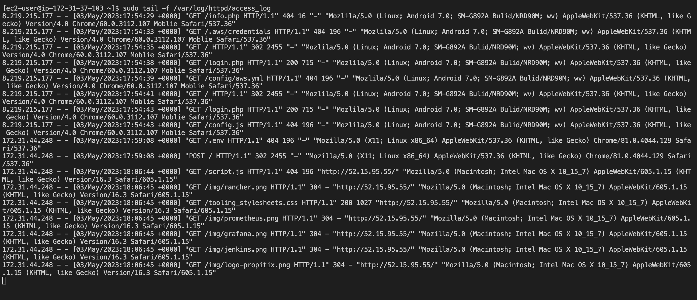
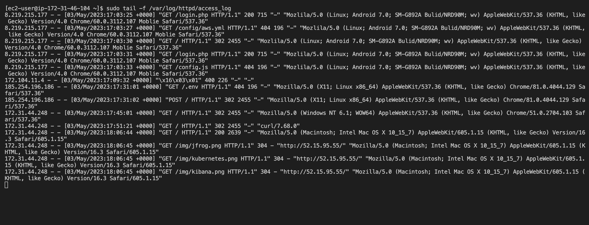

# LOAD BALANCER SOLUTION WITH APACHE

## **WHY LOAD BALANCER ?**

- When we access a website in the Internet, we use an URL and we do not really know how many servers are out there serving our requests. Each URL contains a domain name part, which is translated (resolved) to IP address of a target server that will serve requests when we open a website in the Internet. Translation (resolution) of domain names is perormed by DNS servers.
When we have just one Web server and load increases, we want to serve more and more customers, we can add more CPU and RAM or completely replace the server with a more powerful one – this is called **"vertical scaling"**. However this approach has limitations, at some point we reach the maximum capacity of CPU and RAM that can be installed into your server.

Another approach used to cater for increased traffic is **"horizontal scaling"**, distributing load across multiple Web servers. This approach is much more common and can be applied almost seamlessly and almost infinitely.

In the set up in Project-7, we had 3 Web Servers and each of them had its own public IP address and public DNS name. A client has to access them by using different URLs, which is not a nice user experience to remember addresses/names of even 3 server, let alone millions of Google servers.

In order to hide all this complexity and to have a single point of access with a single public IP address/name, a Load Balancer can be used. A **Load Balancer** (LB) distributes clients’ requests among underlying Web Servers and makes sure that the load is distributed in an optimal way.

- **In this project, I enhanced the Tooling Website solution in Project-7 by adding a Load Balancer to distribute traffic between Web Servers and allow users to access our website using a single URL.**


- Task
Deploy and configure an Apache Load Balancer for Tooling Website solution on a separate Ubuntu EC2 intance. Make sure that users can be served by Web servers through the Load Balancer.

To simplify, let us implement this solution with 2 Web Servers, the approach will be the same for 3 and more Web Servers

- Prerequisites

Make sure the following servers are installed and configured within Project-7:
1. Two RHEL8 Web Servers
2. One MySQL DB Server (based on Ubuntu 20.04)
3. One RHEL8 NFS server


### **Configure Apache As A Load Balancer**

1. Open TCP port 80 on Project-8-apache-lb by creating an Inbound Rule in Security Group


2. Install Apache Load Balancer on Project-8-apache-lb server and configure it to point traffic coming to LB to both Web Servers: 

- Install apache2
```
sudo apt update
sudo apt install apache2 -y
sudo apt-get install libxml2-dev
```


- Enable following modules:
```
sudo a2enmod rewrite
sudo a2enmod proxy
sudo a2enmod proxy_balancer
sudo a2enmod proxy_http
sudo a2enmod headers
sudo a2enmod lbmethod_bytraffic
```

- Restart apache2 service

`sudo systemctl restart apache2`


- Make sure apache2 is up and running

`sudo systemctl status apache2`


- Configure load balancing

`sudo vi /etc/apache2/sites-available/000-default.conf`

- Add this configuration into this section <VirtualHost *:80>  </VirtualHost>


```
<Proxy "balancer://mycluster">
               BalancerMember http://<WebServer1-Private-IP-Address>:80 loadfactor=5 timeout=1
               BalancerMember http://<WebServer2-Private-IP-Address>:80 loadfactor=5 timeout=1
               ProxySet lbmethod=bytraffic
               # ProxySet lbmethod=byrequests
        </Proxy>

        ProxyPreserveHost On
        ProxyPass / balancer://mycluster/
        ProxyPassReverse / balancer://mycluster/
```

- Restart apache server

`sudo systemctl restart apache2`


3. Verify that our configuration works – try to access your LB’s public IP address or Public DNS name from your browser.

`http://<Load-Balancer-Public-IP-Address-or-Public-DNS-Name>/index.php`


- Open two ssh/Putty consoles for both Web Servers and run following command

`sudo tail -f /var/log/httpd/access_log`

- Try to refresh your browser page `http://<Load-Balancer-Public-IP-Address-or-Public-DNS-Name>/index.php` several times and make sure that both servers receive HTTP GET requests from your LB – new records must appear in each server’s log file. The number of requests to each server will be approximately the same since we set loadfactor to the same value for both servers – it means that traffic will be disctributed evenly between them.






## Configure Local DNS Names Resolution

- Sometimes it is tedious to remember and switch between IP addresses, especially if you have a lot of servers under your management.
What we can do, is to configure local domain name resolution. The easiest way is to use /etc/hosts file, although this approach is not very scalable, but it is very easy to configure and shows the concept well. So let us configure IP address to domain name mapping for our LB

- Open this file on your LB server

`sudo vi /etc/hosts`

- Add 2 records into this file with Local IP address and arbitrary name for both of your Web Servers

`<WebServer1-Private-IP-Address>` Web1

`<WebServer2-Private-IP-Address>` Web2

- Now you can update your LB config file with those names instead of IP addresses.

BalancerMember http://Web1:80 loadfactor=5 timeout=1

BalancerMember http://Web2:80 loadfactor=5 timeout=1

- You can try to curl your Web Servers from LB locally `curl http://Web1` or `curl http://Web2`


**Note:** this is only internal configuration and it is also local to your LB server, these names will neither be ‘resolvable’ from other servers internally nor from the Internet.

- Now the set up looks like this:


